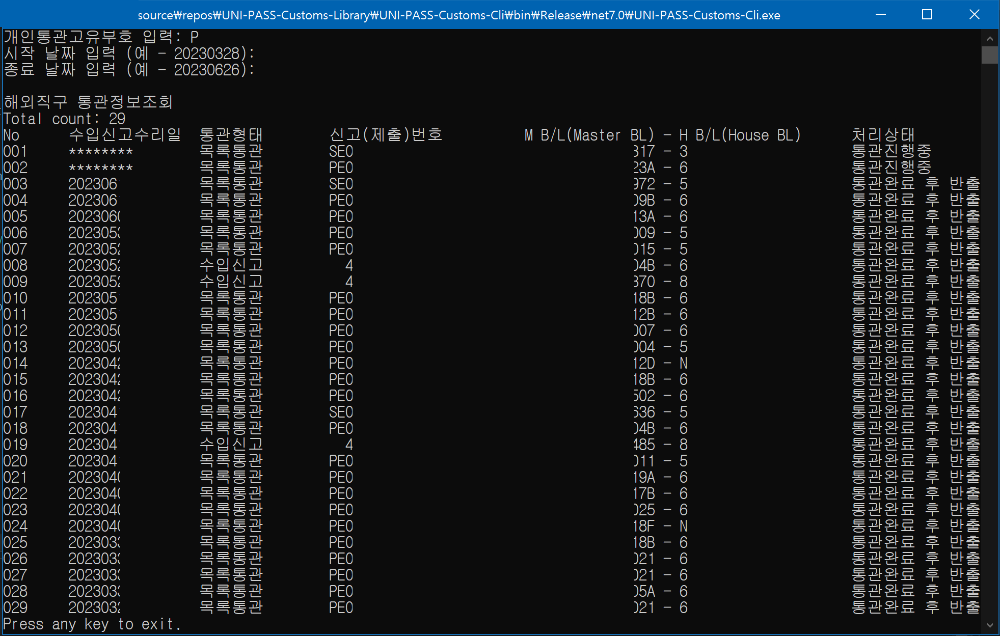

# UNI-PASS-Customs-Library
[]
## 어떤 프로그램인가요?
해외직구 통관정보조회 프로그램입니다.   
수입화물진행정보(건별) 조회는 구현 하지 않았습니다.   

## 사용 방법은 무엇인가요?
개인통관번호, 날짜 입력하시면 됩니다.   

## 데이터는 어디서 가져오나요?
[UNI-PASS](https://unipass.customs.go.kr/) 에서 가져 옵니다.

## 참조 사이트
클리앙 레이꽁님이 제작하신 통관목록 조회 사이트  
https://reikop.io/pass/  
  
UNI-PASS  
https://unipass.customs.go.kr  
  
ChatGPT - C# 코드 변환 및 일부 코드는 ChatGPT 이용하여 작성했습니다.  
https://openai.com/  

## 주의!!!
프로그램 사용으로 인한 발생하는 문제에 대한 모든 책임은 사용자에게 있습니다.  
파싱 과정에서 IP 차단 가능성이 있습니다.  

## LICENSE
MIT License  
  
Copyright (c) 2023 Dev-Squirrel